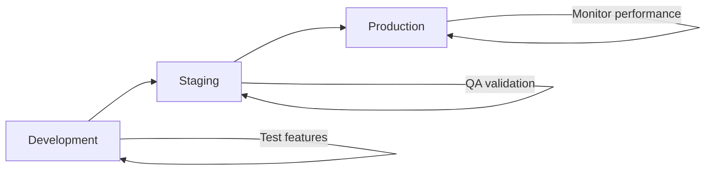

# Workspace Best Practices

This guide covers best practices for organizing, securing, and managing your Usertune workspaces effectively.

## 🏗️ Workspace Organization

### Naming Conventions

Use clear, descriptive names that indicate the workspace purpose:

#### ✅ Good Examples
```
• ecommerce-website-prod
• mobile-app-ios-staging  
• client-acme-marketing
• saas-platform-onboarding
• blog-personalization
```

#### ❌ Avoid These
```
• workspace-1
• test
• my-project
• temp
• new-workspace
```

### Project Structure

Organize workspaces by logical boundaries:

#### **By Application**
```
📁 E-commerce Company
├── 🏠 ecommerce-website (Main website)
├── 📱 mobile-app-ios (iOS app)
├── 📱 mobile-app-android (Android app)
└── 📧 email-campaigns (Email personalization)
```

#### **By Environment**
```
📁 SaaS Product
├── 🔧 myapp-development
├── 🧪 myapp-staging
└── 🚀 myapp-production
```

#### **By Client (Agencies)**
```
📁 Agency Workspaces
├── 🏢 client-techcorp-website
├── 🏪 client-retailer-ecommerce
├── 💊 client-healthcare-portal
└── 🎓 client-university-portal
```

## 🔐 Security Best Practices

### API Key Management

#### **Environment Separation**
Always use different API keys for different environments:

```bash
# Production environment
USERTUNE_API_KEY=pk_live_prod_1234567890...

# Staging environment  
USERTUNE_API_KEY=pk_live_staging_1234567890...

# Development environment
USERTUNE_API_KEY=pk_dev_1234567890...
```

#### **Key Rotation Schedule**
- **Production keys**: Rotate every 90 days
- **Development keys**: Rotate every 6 months
- **Emergency rotation**: Immediately if compromised

#### **Storage Security**
```bash
# ✅ Store in environment variables
export USERTUNE_API_KEY="pk_live_..."

# ✅ Use secrets management
kubectl create secret generic usertune-api \
  --from-literal=api-key="pk_live_..."

# ❌ Never hardcode in source code
const apiKey = "pk_live_1234567890..."; // DON'T DO THIS
```

### Access Control

#### **Team Permissions**
Assign minimal necessary permissions:

```
👤 Team Roles
├── 🔴 Admin (Full access)
│   └── Tech leads, DevOps
├── 🟡 Editor (Content management)
│   └── Content creators, Marketers
└── 🟢 Viewer (Read-only)
    └── Stakeholders, Analysts
```

#### **Regular Audits**
- **Monthly**: Review team member access
- **Quarterly**: Audit API key usage
- **After departures**: Immediately revoke access

## 📊 Performance Optimization

### Content Organization

#### **Logical Grouping**
Group related content for better management:

```
📄 Content Structure
├── 🏠 Homepage
│   ├── hero-banner
│   ├── featured-products
│   └── testimonials
├── 🛒 Product Pages
│   ├── product-recommendations
│   ├── price-display
│   └── add-to-cart-cta
└── ✅ Checkout
    ├── checkout-form
    ├── payment-options
    └── confirmation-message
```

#### **Naming Strategy**
Use consistent, descriptive content slugs:

```bash
# ✅ Good naming pattern
{page}-{component}-{purpose}
homepage-hero-banner
product-page-recommendations
checkout-payment-form

# ✅ Include context when helpful
mobile-navigation-menu
desktop-sidebar-ads
email-newsletter-cta
```

### Caching Strategy

#### **Content Design for Caching**
Structure content to be cache-friendly:

```json
{
  "variant": {
    "data": {
      "title": "Summer Sale",
      "discount": "20%",
      "valid_until": "2025-08-31",
      "cache_duration": 3600
    }
  }
}
```

#### **API Call Optimization**
- **Batch requests** when possible
- **Cache responses** at application level
- **Use consistent field structure** across variants

## 👥 Team Collaboration

### Workflow Organization

#### **Content Review Process**
1. **Draft** → Content creator makes changes
2. **Review** → Team lead reviews content
3. **Approve** → Content goes live
4. **Monitor** → Track performance

#### **Change Management**
```
🔄 Content Lifecycle
├── 📝 Draft (Work in progress)
├── 👀 Review (Pending approval)
├── ✅ Active (Live content)
├── 📊 Testing (A/B test running)
└── 📚 Archived (No longer used)
```

### Communication

#### **Documentation Standards**
- **Content descriptions** - Clear purpose for each item
- **Variant explanations** - Why each variant exists
- **Targeting logic** - Who should see what content
- **Success metrics** - How to measure performance

#### **Change Notifications**
Set up alerts for important changes:
- **Content updates** - Notify relevant team members
- **Performance drops** - Alert when metrics decline
- **API errors** - Monitor for integration issues

## 🚀 Deployment Strategy

### Environment Progression

#### **Development → Staging → Production**


#### **Content Promotion**
1. **Develop** content in development workspace
2. **Test** functionality and targeting rules
3. **Promote** to staging for QA review
4. **Deploy** to production after approval

### Rollback Planning

#### **Backup Strategy**
- **Version control** - Track all content changes
- **Snapshot backups** - Regular workspace backups
- **Rollback procedures** - Quick revert process

#### **Emergency Procedures**
```bash
# Quick content rollback
1. Identify problematic content
2. Switch to previous variant
3. Monitor for resolution
4. Investigate root cause
```

## 📈 Monitoring & Analytics

### Key Metrics to Track

#### **Performance Metrics**
- **Response time** - API call latency
- **Error rate** - Failed API requests
- **Cache hit rate** - Caching effectiveness
- **Content impressions** - How often content is viewed

#### **Business Metrics**
- **Conversion rate** - Goal completion percentage
- **Engagement rate** - User interaction with content
- **Revenue impact** - Financial effect of personalization
- **A/B test results** - Variant performance comparison

### Alerting Setup

#### **Critical Alerts**
- **API downtime** - Service unavailable
- **High error rate** - > 5% of requests failing
- **Performance degradation** - Response time > 100ms

#### **Warning Alerts**
- **Unusual traffic patterns** - Unexpected usage spikes
- **Low conversion rates** - Performance below baseline
- **Content not found** - Missing content requests

## 🔍 What's Next?

Continue learning about workspace management:

- [← Getting Started](getting-started.md) - Initial workspace setup
- [Team Management →](team-management.md) - Managing team access
- [API Keys →](api-keys.md) - Advanced API key management
- [← What is a Workspace?](what-is-workspace.md) - Core concepts

**Ready for advanced topics?** Explore [Content Management](../content/) and [Variant Optimization](../variants/).

---

**Need help?** Contact our support team at [customer@usertune.io](mailto:customer@usertune.io) 